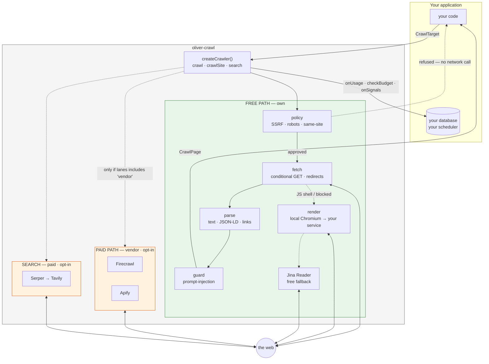
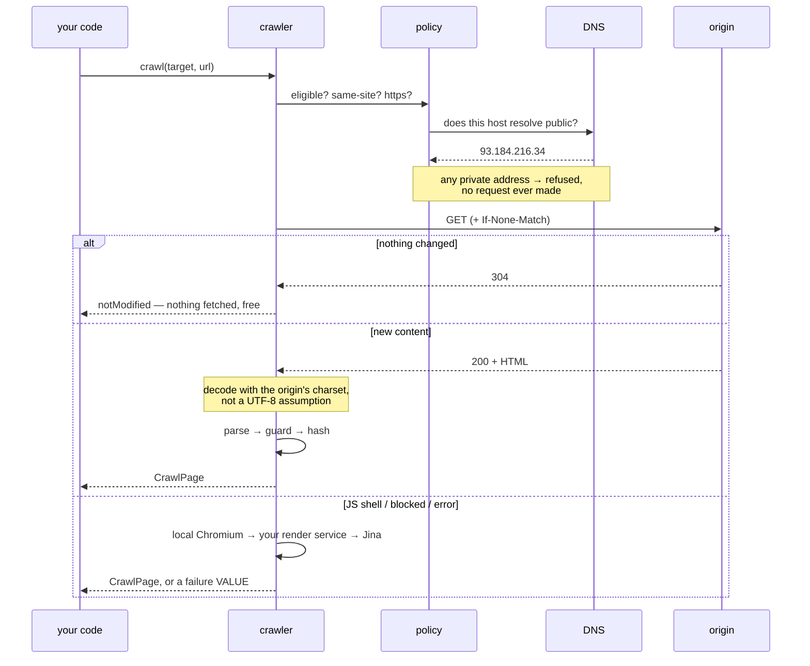
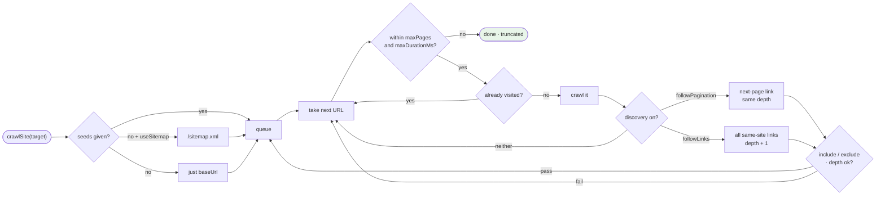
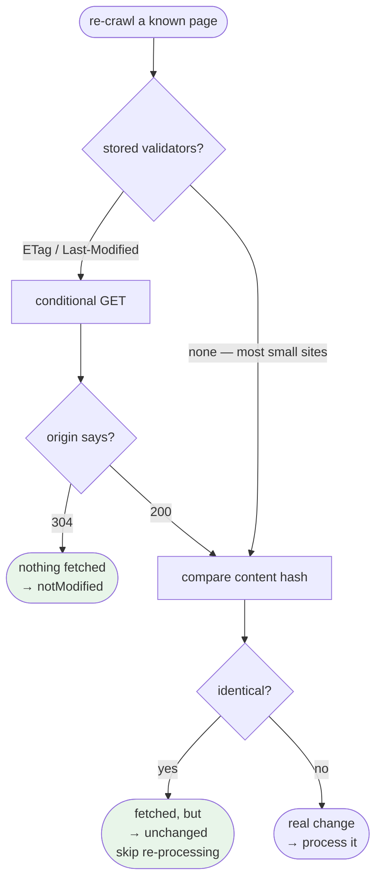

# Architecture

How a request actually flows, and why the pieces are split the way they are.

## The whole picture



Green needs no credentials and costs nothing. Orange bills per call and stays off unless a call asks for it.

## One page, start to finish



## Deciding what to crawl



Breadth-first: pages a site links from its homepage are the ones it considers important, so a run that hits `maxPages` keeps the useful pages rather than descending one deep branch.

## Why the boundaries are where they are

| Boundary | Reason |
|---|---|
| **No database in the package** | Your app owns persistence. State leaves through `onUsage` / `checkBudget` / `onSignals` callbacks, so Fallow can write Postgres, another repo a spreadsheet, a fork nothing at all. |
| **No env reads in core** | Config is passed explicitly (`configFromEnv()` is opt-in sugar), so two differently-configured crawlers can exist in one process. |
| **Domain extraction is yours** | You get text, markdown, JSON-LD and links. The mapping from a page to your own records is defined by your schema; any version shipped here would be wrong for every consumer that did not share it. |
| **The two paths are separate** | A reader must be able to tell which code can bill them, and the default must never spend money. |
| **Policy refusals never escalate** | Paying a vendor to fetch what your own guard refused would buy a way around your own controls. |

## Making repeat crawls cheap

Two mechanisms, because origins differ:



The structural hash (`contentRegionSha256`) ignores nav/header/footer, so a cookie-banner tweak isn't a content change — but it only exists for HTML. Text-only rungs (Jina, vendor) set it empty and the comparison falls back to `textSha256`, so a rung change can never fake a content change.

## Module map

```
src/
  index.ts              createCrawler — lane selection, cache, retry
  crawl-site.ts         multi-page: seeds, discovery, budgets, dedup, resume
  map-site.ts           what URLs exist, without crawling them
  search-and-crawl.ts   search → crawl bridge, guards re-applied per result
  core/
    types.ts            the contract everything is built against
    config.ts           defaults, env sugar, limits
    net-address.ts      IP classification (shared by both guards)
    url-safety.ts       is an EXTRACTED url safe to keep?
    url-dedup-key.ts    canonical identity — /a, /a/, /a?utm= are one page
    content-kind.ts     html / calendar / csv / json / feed / text
    charset.ts          decode with the origin's encoding
    host-throttle.ts    per-host pacing, adaptive
    rung-memory.ts      which rung works per host (per-crawler, never global)
    failure-class.ts    transient vs structural — is a retry worth it?
    soft-404.ts         did this page actually say anything?
    extractor-version.ts stamp, so improvements can reach stored pages
    page-cache.ts       in-process stampede guard
    hash.ts             cross-runtime SHA-256
    usage.ts            report a call, never throw
  fetch/
    build-page.ts       HTML -> CrawlPage: the one place a page shape is made
    http-mechanics.ts   body cap, safe redirect loop, Retry-After
    host-policy.ts      SSRF/DNS-rebinding — may we request this?
    robots-check.ts     robots.txt fetch + parse
    jina-fetch.ts       free keyless fallback
    local-render.ts     free local Chromium
    browser-render.ts   your own render service
    sitemap-discovery.ts
    feed-discovery.ts
    cheap-change-probe.ts
  extract/
    html-to-markdown.ts  main-content Markdown — the field to feed an LLM
    structured-summary.ts is any of this JSON-LD actually about the content?
    content-images.ts    flyer/poster candidates (finding is free, reading is not)
    content-diff.ts      what changed, not just that something did
    detail-link-picker.ts which link answers a still-missing field
    jsonld-event.ts · jsonld-address.ts
    content-region-hash.ts · spa-content-extract.ts
    pagination-discovery.ts · extraction-recipe.ts (replay only)
  guard/
    prompt-injection-guard.ts
  lanes/
    own/index.ts        the free ladder
    vendor/index.ts     Firecrawl, Apify
  search/index.ts       Serper, Tavily
```

---

**See also:** [DECISIONS](DECISIONS.md) — why the code is the way it is · [README](../README.md) · [LANES](LANES.md) — the rung ladder in order · [REFERENCE](REFERENCE.md) — every option and return field · [MIGRATION](MIGRATION.md) — where the code came from · [BACKLOG](BACKLOG.md) — known gaps
